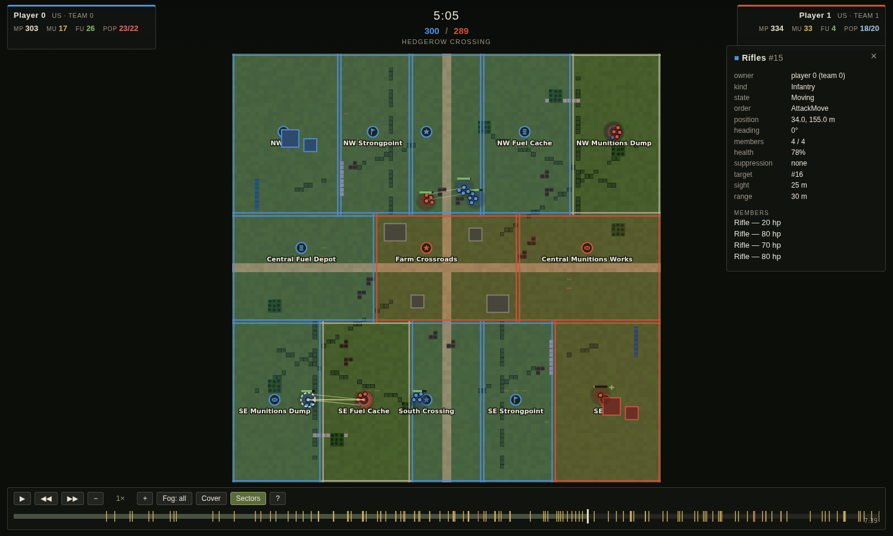
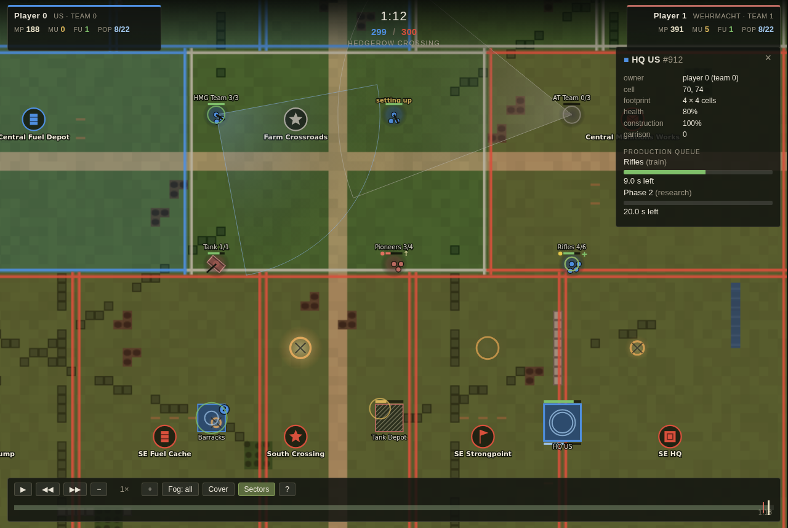
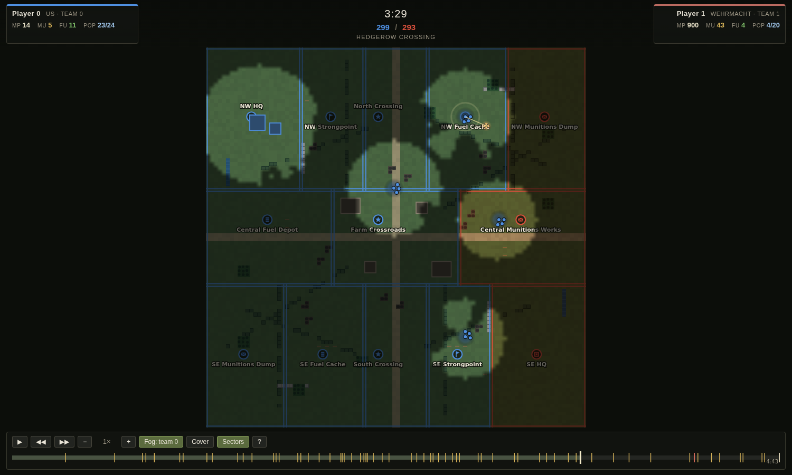

# coh-rl

A Company of Heroes 1 mechanics clone used as a reinforcement-learning environment: a deterministic tick-based sim (`coh/sim`), a Gym-style wrapper (`coh/env`), and a browser-based replay viewer, driven entirely by data tables scraped/estimated into `coh/data`. See `docs/superpowers/specs/2026-09-19-coh-rl-env-design.md` for the design and `docs/superpowers/plans/2026-09-19-m1-playable-sim.md` for the implementation plan.

Setup and usage:

```
uv sync
uv run pytest
uv run python scripts/play_match.py
uv run python -m coh.viewer <replay>
```

## Performance

`scripts/bench_sim.py` measures simulation throughput and breaks it down per
tick system. It times each system by wrapping the module's `run` from the
script, so no timing code lives inside `coh/sim`.

```
# the number that matters for RL: 30 squads a side, mixed arms, fighting flat out
uv run python scripts/bench_sim.py --stress --data-dir tests/data/fixtures --seconds 600

# a scripted T1-vs-T1 match (includes the agents and build_observation)
uv run python scripts/bench_sim.py --data-dir tests/data/fixtures --seconds 600

# add --profile 30 for a cProfile table on top of the per-system breakdown
```

Single core, Python 3.12, `hedgerow_crossing`, fixture tables (a Ryzen
dev box; treat the ratios as the durable part):

| mode | before task 18 | now |
| --- | --- | --- |
| `--stress`, first 20 game-s (full 60-squad army) | 817 ticks/s | **1085 ticks/s** |
| `--stress`, default 600 game-s (army attrits) | 3330 ticks/s | 4038 ticks/s |
| T1-vs-T1 match, 600 game-s | 6628 ticks/s | 7365 ticks/s |

1085 ticks/s is ~136 game-seconds per wall-second with 60 squads on the field,
so a 25-minute match costs about 11 wall-seconds at that load. Where the time
goes in the stress mode is combat ~54% (target acquisition and bullet
resolution), vision ~25%, suppression ~8%, territory ~5%, everything else under
3% each. The remaining hotspot is per-squad target acquisition: it is already
filtered by a squared-distance pass over a per-tick position array, and the
next real step would be a coarse spatial hash so a squad only ever looks at
enemies in neighbouring buckets.

`tests/scenarios/test_perf.py` keeps a loose 300 ticks/s floor under the same
stress state (`uv run pytest -m perf`).

## Replay viewer

`python -m coh.viewer` re-simulates a replay into a compact frame stream
(`coh/viewer/frames.py`), then serves it gzipped at `/frames.json` next to the
dependency-free canvas app in `viewer/`. Replays store only the order log, so
the frames are rebuilt exactly, not stored.

```
uv run python scripts/play_match.py --map hedgerow_crossing \
    --p0 t1 --p1 t1 --seed 0 --data-dir tests/data/fixtures --out match.replay.json
uv run python -m coh.viewer match.replay.json --data-dir tests/data/fixtures
# open http://127.0.0.1:8000/   (add #paused to open on the first frame)
```



Territory is tinted and outlined by the owning team, squads are drawn as one
dot per living model in the sim's own formation, vehicles get a rotated hull
and a turret line, team weapons show their set-up arc, and shots, explosions,
captures and deaths animate from the sim's event log. The HUD tracks manpower,
munitions, fuel, population and victory tickets; click any squad or building to
inspect its frame fields, and the winner is announced on the last frame.

Every unit presentation and event effect in one frame — set-up and
setting-up team weapons, an abandoned gun, a tank and its turret, retreating,
pinned and reinforcing infantry, a garrison badge, a half-built structure with
its production queue, and blast / wreck / ejection effects:



Press `F` to cycle the fog of war between omniscient, team 0's view and team
1's view. The frames are omniscient; the filtering is the client's job, and it
is thorough — in a team view, unseen ground is dimmed, enemy squads outside
that team's vision are hidden (and unclickable), enemy buildings it has seen
before become greyed "last known" outlines whose inspector reports only when
they were last seen, enemy buildings it has never seen are not drawn at all,
and effects it could not have witnessed are dropped. Sector ownership, capture
progress and the timeline event marks stay omniscient.



Controls: space play/pause, `←`/`→` step a frame, `+`/`−` speed (0.5×–16×),
scrub the timeline (capture and kill ticks are marked), wheel to zoom, drag to
pan, `C` cover overlay, `G` sector borders and names, `Home` to reset the
camera, `?` for the full legend.

Options: `--port`, `--data-dir` (defaults to the replay's own hint), `--every N`
to change the snapshot rate, and `--no-serve --out frames.json.gz` to write the
stream instead of serving it.
