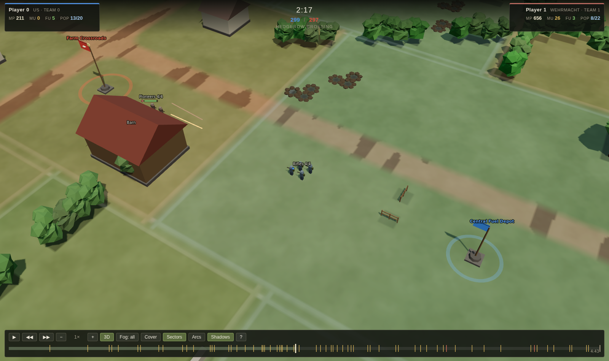
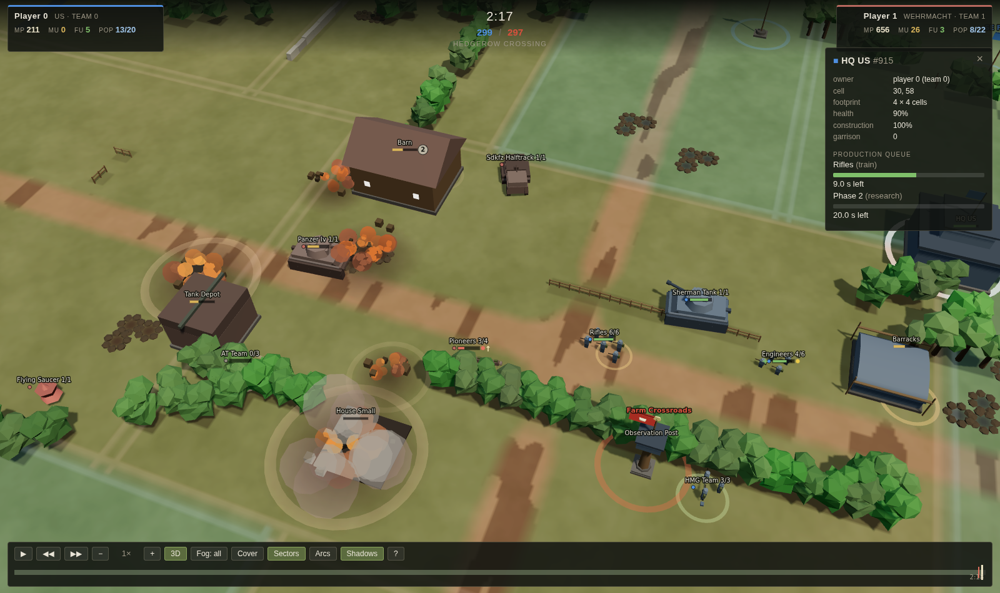
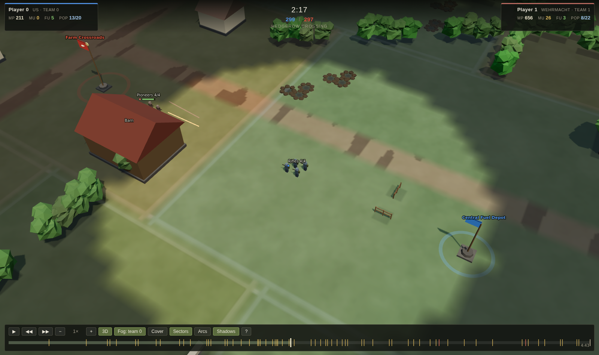

# coh-rl

A Company of Heroes 1 mechanics clone used as a reinforcement-learning environment: a deterministic tick-based sim (`coh/sim`), a Gym-style wrapper (`coh/env`), and a browser-based replay viewer, driven entirely by data tables scraped/estimated into `coh/data`. See `docs/superpowers/specs/2026-09-19-coh-rl-env-design.md` for the design and `docs/superpowers/plans/2026-09-19-m1-playable-sim.md` for the implementation plan.

Setup and usage:

```
uv sync
uv run pytest
uv run python scripts/play_match.py
uv run python -m coh.viewer <replay>
```

## Performance

`scripts/bench_sim.py` measures simulation throughput and breaks it down per
tick system. It times each system by wrapping the module's `run` from the
script, so no timing code lives inside `coh/sim`.

```
# the number that matters for RL: 30 squads a side, mixed arms, fighting flat out
uv run python scripts/bench_sim.py --stress --data-dir tests/data/fixtures --seconds 600

# a scripted T1-vs-T1 match (includes the agents and build_observation)
uv run python scripts/bench_sim.py --data-dir tests/data/fixtures --seconds 600

# add --profile 30 for a cProfile table on top of the per-system breakdown
```

Single core, Python 3.12, `hedgerow_crossing`, fixture tables (a Ryzen
dev box; treat the ratios as the durable part):

| mode | before task 18 | now |
| --- | --- | --- |
| `--stress`, first 20 game-s (full 60-squad army) | 817 ticks/s | **1085 ticks/s** |
| `--stress`, default 600 game-s (army attrits) | 3330 ticks/s | 4038 ticks/s |
| T1-vs-T1 match, 600 game-s | 6628 ticks/s | 7365 ticks/s |

1085 ticks/s is ~136 game-seconds per wall-second with 60 squads on the field,
so a 25-minute match costs about 11 wall-seconds at that load. Where the time
goes in the stress mode is combat ~54% (target acquisition and bullet
resolution), vision ~25%, suppression ~8%, territory ~5%, everything else under
3% each. The remaining hotspot is per-squad target acquisition: it is already
filtered by a squared-distance pass over a per-tick position array, and the
next real step would be a coarse spatial hash so a squad only ever looks at
enemies in neighbouring buckets.

`tests/scenarios/test_perf.py` keeps a loose 300 ticks/s floor under the same
stress state (`uv run pytest -m perf`).

## Replay viewer

`python -m coh.viewer` re-simulates a replay into a compact frame stream
(`coh/viewer/frames.py`), then serves it gzipped at `/frames.json` next to the
static page in `coh/viewer/static/`. Replays store only the order log, so the
frames are rebuilt exactly, not stored.

```
uv run python scripts/play_match.py --map hedgerow_crossing \
    --p0 t1 --p1 t1 --seed 0 --data-dir tests/data/fixtures --out match.replay.json
uv run python -m coh.viewer match.replay.json --data-dir tests/data/fixtures
# open http://127.0.0.1:8000/
```



The default view is a 3D battlefield: a pitched, rotatable camera over ground
textured from a procedurally painted canvas, with bocage banks and tree
clusters that really do occlude, low-poly infantry standing at the sim's own
formation offsets, boxy but recognisable tanks whose turrets track
`turret_heading`, farmhouses with pitched roofs and lit windows when
garrisoned, flagpoles whose flags rise with capture progress, and tracers,
fireballs, dirt and scorch marks driven by the sim's event log. A warm sun
with soft shadows, hemisphere fill, horizon haze and ACES tone mapping keep it
muted rather than neon.

The simulation is unchanged and still planar — CoH1's gameplay is — so this is
purely a renderer. `V` switches to the **2D tactical map**, the original canvas
view, which CoH has too; the choice is remembered in the URL hash
(`#paused&view=2d` is a deep link into a moment *and* a way of looking at it).


The tactical map is unchanged: territory tinted and outlined by the owning
team, one dot per living model on the sim's own formation offsets, rotated
vehicle hulls with a turret line, set-up arcs, and the same tracers,
explosions, captures and deaths. Its own unit/effect showcase is
[`docs/img/viewer-units.png`](docs/img/viewer-units.png), regenerated by
`tests/viewer/test_viewer_browser.py`. The HUD tracks manpower, munitions,
fuel, population and victory tickets in both views; click any squad or building
to inspect its frame fields, and the winner is announced on the last frame.

Everything the scripted fixture agents never produce, in one synthetic frame —
tanks mid-duel, an HMG dug in behind bocage covering a road, mortar shells
landing, a garrisoned farmhouse taking fire, a barracks under construction, a
cottage collapsing, an abandoned AT gun, a wreck and a full production queue:



Press `F` to cycle the fog of war between omniscient, team 0's view and team
1's view. The frames are omniscient; the filtering is the client's job, it is
done once in `coh/viewer/static/js/data.js`, and **both views consume that same
answer** — so the rules cannot drift apart. In a team view unseen ground is
washed out, enemy squads outside that team's vision are absent from the scene
and unclickable, enemy buildings it has seen before become translucent grey
"last known" volumes whose inspector reports only when they were last seen,
enemy buildings it has never seen are not drawn at all, effects it could not
have witnessed are dropped, and even the persistent scorch marks and wrecks are
only laid down for blasts it could have seen happen. Sector ownership, capture
progress and the timeline event marks stay omniscient, as they do in CoH.



Controls: `V` switch views, space play/pause, `←`/`→` step a frame, `+`/`−`
speed (0.5x-16x), scrub the timeline (capture and kill ticks are marked), drag
to pan, right-drag or `Q`/`E` to rotate, `W A S D` to pan, wheel to zoom toward
the cursor, click to inspect, double-click to follow a unit, `C` cover overlay,
`G` territory and sector borders, `Z` weapon arcs, `H` shadows, `Home` to reset
the camera, `?` for the full legend.

Add `?quality=low` for a lighter 3D view (no shadows, smaller textures). If the
browser cannot give the page a WebGL context at all, the 3D module is never
even downloaded and it falls back to the tactical map with a notice.

### three.js, vendored

The 3D view uses [three.js](https://threejs.org) r169 (MIT), vendored as a
single pinned `build/three.module.min.js` under
`coh/viewer/static/vendor/three/` and imported through an import map in
`index.html`. There is no build step and no CDN: the viewer works with no
network access at all. See that directory's `README.md` for how to refresh it.

### Alternative looks

Every model is procedural, and every one of them goes through a registry, so a
different look can be dropped in without touching the renderer:

```js
import * as models from './js/view3d/models.js';
import { Parts } from './js/view3d/geom.js';

// 'building' | 'vehicle' | 'weapon' | 'soldier' | 'point'
// the pattern is an exact def id, a RegExp over it, or a predicate on the
// context; the last matching registration wins, so a pack loaded later wins
models.register('vehicle', /sherman|panzer/, function (ctx) {
  const hull = new Parts(), turret = new Parts();
  hull.box(5.4, 1.0, 2.7, ctx.colour, { y: 1.05 });
  turret.cyl(1.2, 1.4, 0.9, ctx.colour, { y: 0.45 });
  return { hull: hull, turret: turret, turretY: 2.0 };
});
```

A factory returns a part list, which is baked into one vertex-coloured mesh —
one draw call per object. Only the procedural default skin ships here; no
third-party or Company of Heroes art is included or downloaded.

Options: `--port`, `--data-dir` (defaults to the replay's own hint), `--every N`
to change the snapshot rate, and `--no-serve --out frames.json.gz` to write the
stream instead of serving it.
